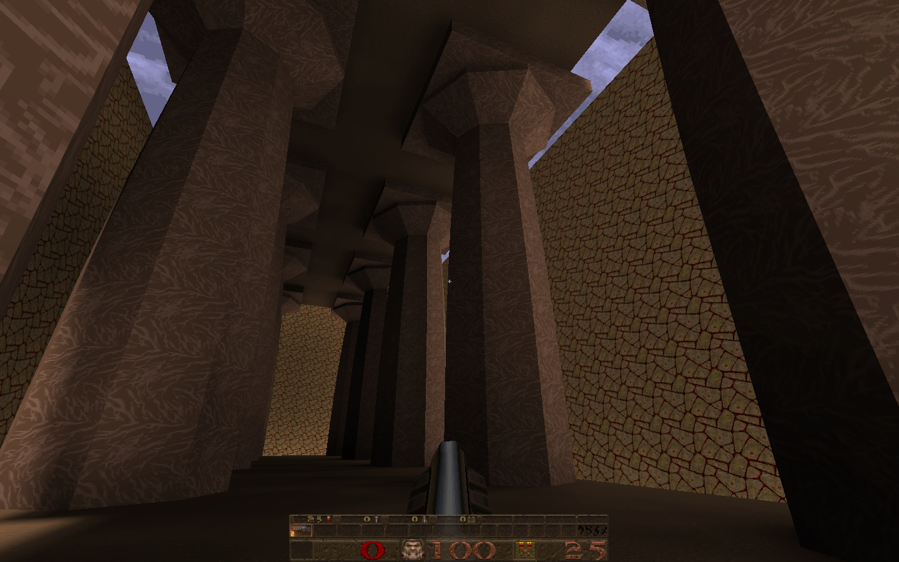

### Temple Maker

A script and helper functions to generate level geometry in the text-based [.map format](https://quakewiki.org/wiki/Quake_Map_Format) for uncompiled Quake levels. 

This script builds grid of octagonal columns with [entasis](https://en.wikipedia.org/wiki/Entasis), an entablature and a crepidoma.

Kevin Higgins, 19/11/20

</img>